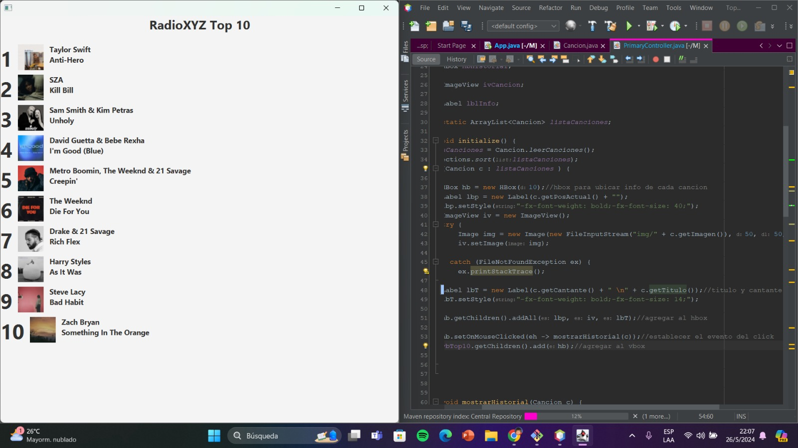

# TallerGit_Dise-oSoftware
Aprender a modificar un proyecto colaborativamente utilizando Git y desarrollar funcionalidades específicas en paralelo utilizando ramas de Git.
Cambio de artista con el título de la canción
