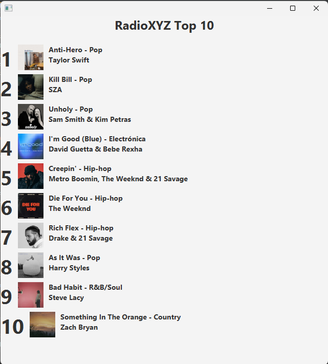

# TallerGit_Dise-oSoftware
Aprender a modificar un proyecto colaborativamente utilizando Git y desarrollar funcionalidades específicas en paralelo utilizando ramas de Git.

Se modificó el archivo, ahora aparecen el género de cada canción a lado del título del mismo.

